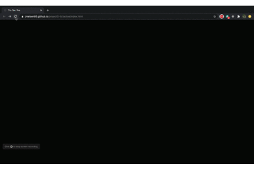

# TIC - TAC - TOE

A "Retro" TTT Game and My first project as part of GA's Software Engineering Immersive. 

## Built With
* Javascript
* Jquery
* HTML
* CSS

## Features
A local two player, 80s / Retro inspired TTT Game.  Intended for implementation but not (yet) realised was the ability to select to avatars and set player names. 

HTML was kept to a mimimum.  A place for everything and everything in it's place i.e. CSS only in CSS File and JS only in JS.  As this was a first foray into application development I deliberately experimented with different ways of doing things.  Jquery and Vanilla JS functions are occassionally blended, so too is there a mix of longform, ternary, aarow functions etc.  The experimentation (i.e. chopping and changing) served an educational purpose, though is also an endorsement for the use of psuedocode and better planning. 

Animations and transitions such as the 'win notification pop up' and the index page animation were achieved through manipulating CSS with JS (for e.g. display: none to inline etc  or visibility: hidden to visible).  This coupled with the possibly gratutious use of divs means the website is not particularly accessible for those with visual impairments a concept we addressed later in the course.  

One of the biggest difficulties faced came from where I least expected it.  The CSS styling required to create retro, 8bit asthetic with buttons and borders.  

## Live Game:
https://jnielsen85.github.io/project0-tictactoe/index.html

